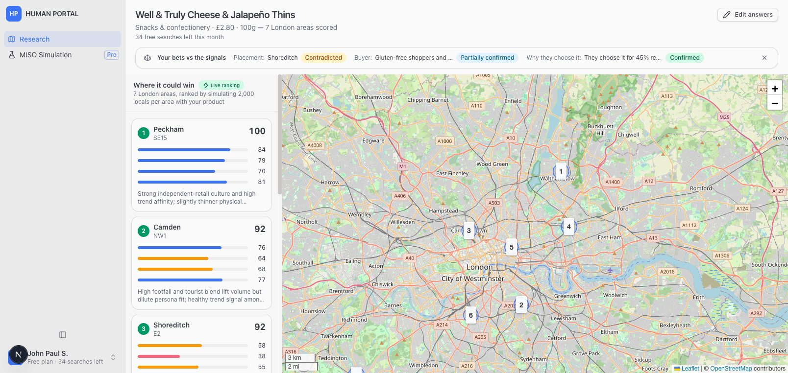

# HUMAN PORTAL

**Where should I sell this product?**

HUMAN PORTAL helps a food or drink founder decide *where in London* to launch a product.
You describe the product and your assumptions, and it:

1. **Maps the opportunity.** Ranks London areas by how well the product sells to simulated
   local shoppers, and
   shows the evidence behind each area (live posts from Reddit and Stack Exchange).
2. **Checks your bets.** Flags where the evidence confirms or contradicts what you guessed
   about your buyer and your best location.
3. **Simulates real shoppers.** Runs the product past **2,000 simulated Londoners** for a week
   and shows who saw it, who wanted it, who bought it, and why the rest didn't.



---

## Quick start

You need **Node.js 20+** and **Python 3.11+**. Run the backend and frontend in two terminals.

### 1. Backend (simulation API), port 8000

```bash
cd backend
python -m venv .venv

# Windows
.venv\Scripts\activate
# macOS / Linux
source .venv/bin/activate

pip install -r requirements.txt
cp .env.example .env          # optional: add a DEEPSEEK_API_KEY (see below)
uvicorn app.main:app --port 8000
```

Check it's running: open http://localhost:8000/api/health. API docs are at http://localhost:8000/docs.

### 2. Frontend (web app), port 3000

```bash
cd frontend
npm install
npm run dev
```

Open **http://localhost:3000**.

> **No API keys needed to try it.** Without a DeepSeek key, shopper interviews use built-in
> template answers. If the backend isn't running, the app falls back to its example data,
> so every screen still works.

### Optional settings (`backend/.env`)

| Variable | What it does |
|---|---|
| `DEEPSEEK_API_KEY` | Turns on AI-written shopper interviews, the AI summary report and sentiment tagging of live posts |
| `POPULATION_SIZE` | Number of simulated shoppers (default 2000) |
| `INTERVIEW_COUNT` | How many shoppers get interviewed after a run (default 80) |

If the backend isn't on `localhost:8000`, set `NEXT_PUBLIC_API_URL` for the frontend.

---

## How to use it (demo walkthrough, about 3 minutes)

1. **Land on the map.** The home page opens on the Research map with an example product
   (*Well & Truly Cheese & Jalapeño Thins*, a £2.80 snack), so you can see results straight away.
2. **Read the ranked areas.** The left list ranks London areas by opportunity score. When the
   backend is running you'll see a **Live ranking** badge: each area is scored by running the
   simulated shoppers with your product. Click an
   area or its circle on the map to open the **evidence sidebar**, with the score breakdown and
   live posts about the category.
3. **Check "Your bets vs the signals".** The strip at the top shows which of the founder's
   guesses (best location, likely buyer, why they buy) the evidence confirms or contradicts.
4. **Test your own product.** Click **Test your product** at the top right. Answer the short
   interview, or press **Demo data** to fill it in automatically, then submit. The map then
   updates for your product.
5. **Simulate.** In an area's sidebar, click **Simulate [product] here**. The simulation shows:
   - a **funnel**: saw it → noticed it → wanted it → bought it
   - the **top reasons people didn't buy** (no shop nearby, didn't notice, too expensive,
     doesn't fit their diet, loyal to another brand)
   - **which groups converted** (age, area, lifestyle, income)
   - **interviews** with simulated shoppers, and an **action list**

---

## How the simulation works (short version)

- **The shoppers are built from real London data.** Age, sex, ethnicity, religion, job,
  employment and how people get to work are sampled neighbourhood by neighbourhood from the
  **UK Census 2021**. Homes are placed using ONS area data, and real shops, gyms and
  universities come from **OpenStreetMap**.
- **Their behaviour is modelled.** Personality, price sensitivity, media habits, diet and
  daily routines come from rules, not real survey data.
- **Each shopper lives a week.** At each point in their day, the engine checks whether they
  pass a shop that stocks your product, notice it, want that kind of product right then, and
  accept the price, ingredients and brand. Results are reproducible: the same inputs always
  give the same outcome.
- **The AI only writes the words.** The simulation decides what each shopper did. The language
  model then puts that into a short first-person quote and is not allowed to change the facts.

The population ships pre-built in `backend/data/processed/`, so there's nothing to download.

---

## Project layout

```
frontend/   Next.js web app (map, interview, simulation screens)
backend/    FastAPI service (shopper population, simulation engine, live signals)
UX-FLOW.md  The product flow in detail
```

## Running tests

```bash
cd backend
pytest
```
